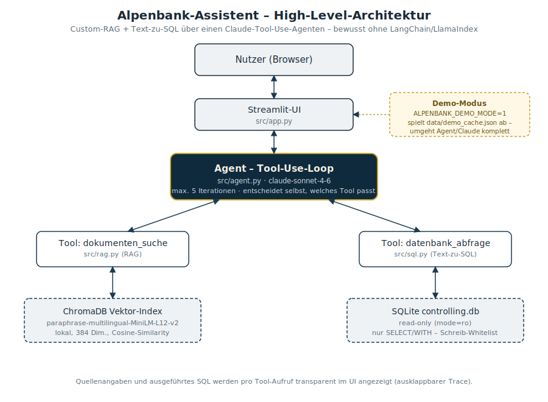
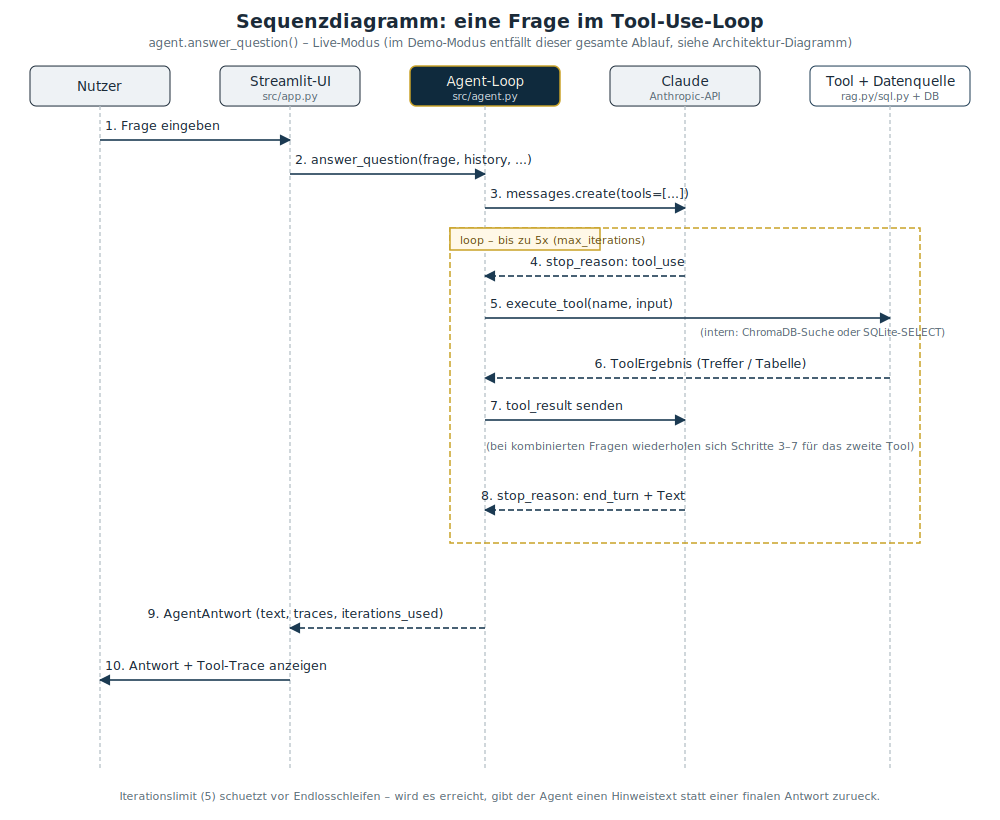

# 🏔️ Alpenbank-Assistent

Chat-Assistent mit RAG und Text-zu-SQL für die fiktive Alpenbank AG – ein
Agent, der über Claudes Tool-Use selbst entscheidet, ob er in internen
Richtlinien sucht, eine SQL-Abfrage gegen die Controlling-Datenbank stellt,
oder beides kombiniert. Ursprünglich als Lernprojekt gebaut (Details siehe
`KONZEPT.md`, Arbeitsregeln siehe `CLAUDE.md`), mittlerweile Teil eines
AI-Architektur-Showrooms.

**➡️ Live-Demo:** *wird nach dem Streamlit-Cloud-Deploy hier verlinkt –
kostenlos, kein API-Key nötig, siehe Abschnitt "Demo-Modus"*

## Architektur





## Voraussetzungen

- Python 3.11 oder höher
- Anthropic API-Key (nur für den Live-Modus – der Demo-Modus braucht keinen)

## Einrichtung

```bash
# 1. Virtuelle Umgebung anlegen und aktivieren (Windows / PowerShell)
python -m venv .venv
.venv\Scripts\activate

# 2. Abhängigkeiten installieren
pip install -r requirements.txt

# 3. API-Key hinterlegen: .env.example nach .env kopieren und Key eintragen
copy .env.example .env

# 4. Auf Windows-Systemen mit Smart App Control / AppLocker ggf. pyarrow
#    entfernen (siehe Abschnitt "Bekannte Stolpersteine" weiter unten).
pip uninstall pyarrow -y
```

> Hinweis: Beim ersten RAG-Lauf wird das mehrsprachige Embedding-Modell
> `paraphrase-multilingual-MiniLM-L12-v2` (~120 MB) automatisch von Hugging
> Face heruntergeladen und unter `~/.cache/huggingface/` zwischengespeichert.
> Folgeläufe sind offline möglich.

## Projektstand

Schritte 1–4 aus `KONZEPT.md` abgeschlossen. Der Assistent ist End-to-End
lauffähig: Streamlit-Chat mit RAG, Text-zu-SQL und Tool-Use-Agent. Claude
entscheidet selbst, welches der zwei Werkzeuge (`dokumenten_suche`,
`datenbank_abfrage`) er für eine Frage benutzt – möglicherweise auch beide
nacheinander. Pro Antwort werden die Tool-Aufrufe als ausklappbare
Trace-Blöcke im UI angezeigt.

Für den Showroom ergänzt: kostenloser Demo-Modus, Beispielfrage-Chips,
Branding sowie strukturiertes Logging und gepinnte Dependencies.

```bash
# Vorab einmalig: Daten erzeugen und RAG-Index aufbauen
python scripts/daten_erzeugen.py
python scripts/rag_index.py

# App starten
streamlit run src/app.py
```

Demo-Fragen (Auswahl, vollständig in `KONZEPT.md`):

- *„Wie hoch waren die Gesamterträge 2024?"* → SQL
- *„Welche Hotelkategorie darf ich bei Dienstreisen buchen?"* → RAG
- *„Warum ist der Aufwand von Kostenstelle 4711 gestiegen?"* → SQL und RAG kombiniert
- *„Lösch alle Buchungen!"* → wird abgelehnt

## Demo-Modus (kostenlos, ohne API-Key)

Für eine öffentlich verlinkbare Demo (z. B. im Showroom) gibt es einen
Modus, der die zehn Demo-Fragen aus vorab aufgezeichneten, echten
Claude-Antworten beantwortet – ohne API-Key auf dem Server und ohne
laufende Kosten pro Besucher:

```bash
# Einmalig lokal mit echtem Key: Cache aus echten Agent-Antworten erzeugen
python scripts/demo_cache_erzeugen.py

# App im Demo-Modus starten (kein ANTHROPIC_API_KEY nötig)
set ALPENBANK_DEMO_MODE=1
streamlit run src/app.py
```

Freitext-Fragen außerhalb der zehn Beispielfragen bekommen im Demo-Modus
einen erklärenden Hinweis statt einer Antwort. Details siehe `src/demo.py`.

## Tests ausführen

```bash
# Konsolen-Ausgabe
pytest -v

# Zusätzlich HTML-Report erzeugen (öffnet sich im Browser)
pytest --html=docs/test-reports/report.html --self-contained-html
```

## Bekannte Stolpersteine

### pyarrow auf Windows mit Smart App Control / AppLocker

`sentence-transformers` zieht transitiv `sklearn` und damit `pyarrow`
mit. Auf Windows-Systemen mit aktiver Smart App Control oder
AppLocker-Richtlinie kann eine DLL aus pyarrow blockiert werden:

```
ImportError: DLL load failed while importing lib:
Eine Anwendungssteuerungsrichtlinie hat diese Datei blockiert.
```

Das Symptom kann je nach Aufrufkontext (direkter Import, Streamlit-
Watcher) auch als `WinError 206` oder als irreführende Meldung
"sentence_transformers not installed" auftauchen. Hintergrund:
`sklearn` fängt nur `ModuleNotFoundError`, nicht `ImportError` ab,
und `chromadb` reicht den Folge-Fehler als generische Meldung weiter.

**Workaround:** pyarrow ist für dieses Projekt nicht nötig –
Markdown-Tabellen kommen ohne pyarrow aus. Nach
`pip install -r requirements.txt` einfach entfernen:

```
pip uninstall pyarrow -y
```

Sklearn arbeitet danach ohne pyarrow weiter (`ModuleNotFoundError`
wird intern abgefangen).

### Streamlit-File-Watcher

Der Standard-Watcher (`fileWatcherType = "auto"`) löst auf manchen
Windows-Setups Folge-Imports von transformers / sklearn / pyarrow
aus, die unter den oben genannten Bedingungen scheitern. Wir
schalten den Watcher in `.streamlit/config.toml` deshalb ab
(`fileWatcherType = "none"`). Trade-off: Streamlit lädt Code-
Änderungen nicht mehr automatisch nach – Browser-Tab nach
Code-Updates manuell neu laden (`F5`).
